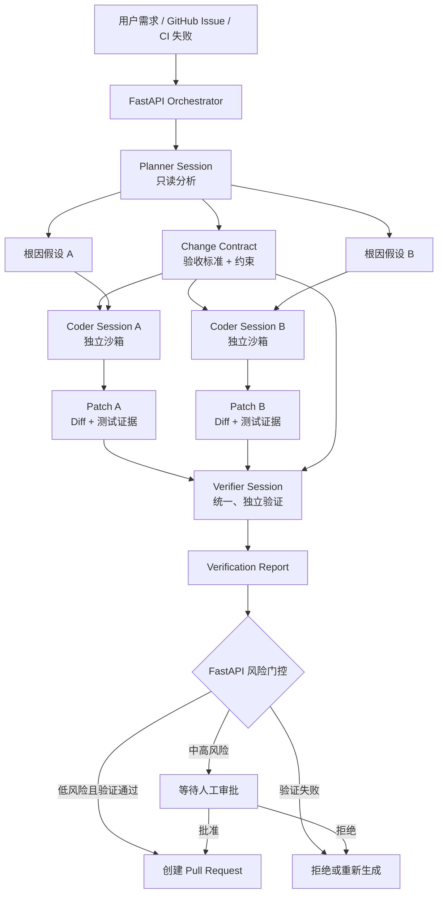

# 方案二：Planner 驱动的双 Coder 候选补丁与独立验证系统

## 1. 方案概述

本方案将现有的“单个 Qoder Cloud Agent Session 接收任务并修改代码”升级为一个由 FastAPI 编排的多阶段代码变更决策系统：

```text
问题输入
  → Planner 分析与生成候选假设
  → 两个独立 Coder Session 分别实现 Patch A / Patch B
  → Verifier 使用统一标准独立验证
  → FastAPI 根据证据进行选择、拒绝或提交人工审批
  → 创建带验证报告的 Pull Request
```

Qoder Cloud Agent 继续作为代码分析与执行引擎；FastAPI 不再只是 API 转发层，而是承担任务建模、候选方案编排、证据收集、风险决策和生命周期管理。

本方案要解决的核心问题不是“AI 能否修改代码”，而是：

> 当 AI 可以生成多个代码修改方案时，系统如何用可验证证据选出更可信的方案，并阻止不可靠补丁进入仓库？

---

## 2. 现有方案

### 2.1 当前链路

```text
用户输入修改需求
  → FastAPI 调用 Qoder Cloud Agents API
  → 创建一个 Coder Session
  → Session 在沙箱中拉取 GitHub 仓库
  → Agent 分析并修改代码
  → Agent 执行测试
  → Agent 提交并推送代码
```

### 2.2 当前职责划分

| 组件 | 当前职责 |
|---|---|
| 用户 | 描述需要修改的内容 |
| FastAPI | 创建 Session、发送消息、接收结果 |
| Qoder Coder Agent | 分析问题、选择方案、修改代码、测试、推送 |
| GitHub | 保存代码和变更结果 |

### 2.3 当前方案的主要问题

#### 单一方案偏差

一个 Session 同时负责诊断、设计、实现和自我验证。一旦最初的根因判断错误，后续修改和测试都可能建立在错误假设上。

#### 生成者与验证者是同一主体

Coder 自己生成补丁，也由自己判断补丁是否正确，容易出现确认偏差。测试通过也不一定说明业务验收条件被满足。

#### FastAPI 缺少独立决策能力

FastAPI 目前主要负责调用接口。即使去掉 FastAPI，用户也可以直接向 Qoder Cloud Agent 发送同样的任务，因此作品自身的技术创新不突出。

#### 缺少可比较的候选方案

系统只有一个 Patch，没有基线或竞争方案，无法回答：

- 是否存在改动更小的实现？
- 是否存在更安全的实现？
- 当前补丁是唯一正确方案，还是 Agent 恰好选择的第一个方案？
- 补丁通过了哪些客观验收条件？

#### 推送决策缺少风险门控

如果 Agent 被直接要求提交和推送，那么“是否允许进入仓库”仍由 Prompt 隐式决定，缺少可审计的准入规则。

---

## 3. 新方案与现有方案的核心区别

| 对比维度 | 现有方案 | 方案二 |
|---|---|---|
| 任务执行 | 单个 Coder Session 端到端完成 | Planner、双 Coder、Verifier 分阶段完成 |
| 根因分析 | Coder 在修改过程中自行判断 | Planner 先生成结构化根因假设和验收标准 |
| 方案数量 | 只生成一个 Patch | 至少生成两个可比较的候选 Patch |
| 运行隔离 | 一个 Session、一个沙箱 | 两个 Coder Session、两个独立沙箱 |
| 起始代码 | 当前仓库状态 | 两个 Coder 必须基于同一 Base Commit |
| Agent 配置 | 一个 Coder Agent | Planner、Coder、Verifier 三类职责配置 |
| Coder 数量 | 一个执行实例 | 同一 Coder Agent 配置复用为两个独立 Session |
| 验证方式 | Coder 自测、自我报告 | Verifier 使用同一套标准独立验证两个 Patch |
| 选择方式 | 没有候选比较 | 基于测试、验收标准、风险和改动范围评分 |
| 推送策略 | Agent 按 Prompt 直接推送 | FastAPI 风险门控后决定拒绝、审批或创建 PR |
| FastAPI 定位 | Cloud Agent API 包装层 | AI 变更控制平面与状态机 |
| 输出内容 | 代码修改和执行结果 | 候选补丁、验证证据、选择理由和风险报告 |
| 创新归属 | 主要来自 Qoder 的代码执行能力 | 主要来自候选生成协议、独立验证和风险决策闭环 |

最关键的变化是：

> 现有方案让 Agent 直接给出答案；方案二让多个候选方案在统一验收标准下竞争，再由独立验证结果决定是否交付。

---

## 4. 总体架构



### 4.1 为什么需要两个独立 Session

两个 Coder 可以复用同一个 Agent 配置，但必须创建两个不同 Session：

```text
Coder Agent Configuration
├── Coder Session A → Sandbox A → Branch candidate/a
└── Coder Session B → Sandbox B → Branch candidate/b
```

原因包括：

1. 避免 Patch A 修改过的文件影响 Patch B。
2. 避免两个执行上下文互相看到对方的推理结果。
3. 保证两个候选补丁都从相同 Base Commit 开始。
4. 可以分别取消、重试和记录成本。
5. 可以对两个候选运行统一验证并进行公平比较。

独立 Session 不代表必须创建两个不同的 Coder Agent。Agent 是可复用的角色配置，Session 才是一次具体执行及其上下文。

---

## 5. 角色设计

## 5.1 Planner Agent

Planner 负责提出 Patch A、Patch B 的方向，但不负责编写代码。

### 职责

- 读取用户需求、Issue、错误日志和失败测试。
- 浏览仓库结构和相关代码。
- 把自然语言需求转换为可验证的 Change Contract。
- 提出两个具有实质差异的根因假设。
- 为每个 Coder 生成独立任务书。
- 明确禁止修改的范围和高风险操作。

### 权限建议

| 工具能力 | 策略 |
|---|---|
| Read / Glob / Grep | Allow |
| 只读测试或静态分析 | Allow |
| Write / Edit | Deny |
| Git Push / 创建 PR | Deny |
| 删除文件或远程资源 | Deny |

### Planner 输出示例

```json
{
  "base_commit": "4b3210e",
  "problem_statement": "刷新令牌在并发请求下可能被重复使用",
  "acceptance_criteria": [
    "旧刷新令牌在第一次成功使用后立即失效",
    "两个并发刷新请求最多只能有一个成功",
    "现有登录和退出流程不受影响"
  ],
  "constraints": [
    "不修改公开 API 返回结构",
    "不降低令牌校验强度",
    "不得直接推送到 main 分支"
  ],
  "candidates": [
    {
      "id": "A",
      "hypothesis": "刷新令牌失效操作与新令牌签发顺序错误",
      "strategy": "调整事务内部的令牌轮换顺序，保持最小改动",
      "files_to_inspect": ["src/auth/refresh.py"]
    },
    {
      "id": "B",
      "hypothesis": "并发刷新缺少原子性控制",
      "strategy": "在持久化层增加条件更新或行级锁",
      "files_to_inspect": [
        "src/auth/refresh.py",
        "src/repositories/token.py"
      ]
    }
  ]
}
```

Planner 输出必须满足：

- 两个假设不能只是措辞不同。
- 每个假设必须可以通过代码或测试证据证伪。
- 如果无法提出两个合理假设，应明确返回 `insufficient_evidence`，而不是强行生成两个方案。

## 5.2 Coder Agent

两个 Coder Session 可以复用同一个 Coder Agent 配置，但接收不同任务书。

### Coder A

- 只验证和实现假设 A。
- 优先采用最小变更策略。
- 如果发现假设 A 不成立，不得为了完成任务强行修改代码。
- 输出 `hypothesis_rejected` 及证据。

### Coder B

- 只验证和实现假设 B。
- 可以采用不同实现路径，但必须满足同一个 Change Contract。
- 同样允许拒绝自己的初始假设。

### Coder 输出要求

```json
{
  "candidate_id": "A",
  "hypothesis_supported": true,
  "branch": "candidate/task-128-a",
  "base_commit": "4b3210e",
  "head_commit": "98fa312",
  "changed_files": ["src/auth/refresh.py", "tests/test_refresh.py"],
  "tests": {
    "command": "pytest tests/test_refresh.py -q",
    "passed": 12,
    "failed": 0
  },
  "summary": "将旧令牌失效与新令牌签发放入同一事务。",
  "known_risks": ["依赖当前数据库事务隔离级别"]
}
```

## 5.3 Verifier Agent

Verifier 不参与候选方案生成，避免形成自我验证闭环。

### 职责

- 获取 Change Contract、Patch A 和 Patch B。
- 确认两个候选来自同一 Base Commit。
- 对两个候选运行完全相同的验证流程。
- 检查每条验收标准是否有对应证据。
- 补充边界测试、并发测试或回归测试。
- 分析改动范围、安全影响和回滚难度。
- 可以推荐 A、推荐 B，也可以拒绝两个候选。

### Verifier 不应做的事

- 不因为某个 Coder 表述更自信而选择它。
- 不直接采用 Coder 的“测试通过”文字结论。
- 不在验证过程中悄悄修复候选补丁。
- 不以“代码看起来合理”代替真实测试结果。

### Verifier 输出示例

```json
{
  "decision": "select_b",
  "candidate_a": {
    "acceptance_pass_rate": 0.67,
    "tests_passed": 126,
    "tests_failed": 1,
    "rejected_reason": "并发刷新测试仍可能产生两个有效令牌"
  },
  "candidate_b": {
    "acceptance_pass_rate": 1.0,
    "tests_passed": 127,
    "tests_failed": 0,
    "risk_level": "medium",
    "confidence_score": 0.91
  },
  "recommendation": "选择 Patch B，但鉴权模块属于高敏感区域，应由人工批准后创建 PR。"
}
```

---

## 6. FastAPI 的新职责

方案二中，FastAPI 从“调用 Qoder 的后端”升级为“AI 代码变更控制平面”。

### 6.1 编排职责

- 创建 Planner Session。
- 校验 Planner 的结构化输出。
- 基于同一 Agent 版本创建两个 Coder Session。
- 将同一个 Base Commit 和 Change Contract 分发给两个 Coder。
- 并行监听两个 Session 的 SSE 或 Webhook 状态。
- 在两个候选结束后创建 Verifier Session。

### 6.2 一致性职责

- 确保候选 A、B 使用同一仓库和 Base Commit。
- 防止重复 Webhook 导致重复创建 Session。
- 为每个阶段生成幂等键。
- 固定 Agent 版本，防止执行期间配置漂移。
- 记录 Session ID、分支、Commit SHA 和验证产物。

### 6.3 决策职责

- 根据 Verifier 结果计算或复核置信度。
- 执行风险门控规则。
- 决定自动创建 PR、等待人工批准、重新执行或终止任务。
- 不允许 Coder Session 直接决定是否合入主分支。

### 6.4 审计职责

- 保存候选方案来源。
- 保存每条验收标准对应的测试证据。
- 保存淘汰另一个候选的原因。
- 保存人工批准或拒绝记录。

这部分是方案中最重要的自主创新归属：Qoder 提供执行能力，FastAPI 定义并控制整个可信变更协议。

---

## 7. 任务状态机

```text
RECEIVED
  → PLANNING
  → PLAN_READY
  → CODING_A + CODING_B
  → CANDIDATES_READY
  → VERIFYING
  → VERIFIED
  → RISK_REVIEW
      ├── REJECTED
      ├── RETRY_REQUIRED
      ├── WAITING_APPROVAL
      └── PR_CREATING
  → PR_CREATED
  → COMPLETED
```

### 异常状态

```text
PLANNER_FAILED
CODER_A_FAILED
CODER_B_FAILED
NO_VALID_CANDIDATE
VERIFIER_FAILED
APPROVAL_REJECTED
PR_CREATION_FAILED
```

允许只有一个 Coder 成功，但不能直接把它视为优胜者。即使只有一个候选，它仍必须通过完整 Verifier 流程。

---

## 8. 候选评分与风险门控

候选评分不应只依赖 LLM 的主观分数。建议以机器可验证结果为主：

| 指标 | 示例权重 | 数据来源 |
|---|---:|---|
| 原有测试通过率 | 25% | 测试命令真实输出 |
| 验收标准覆盖率 | 25% | 验收测试映射 |
| 新增边界测试 | 15% | Verifier 测试结果 |
| 回归与静态检查 | 15% | Lint、类型检查、安全扫描 |
| 改动范围与复杂度 | 10% | Git Diff 和复杂度工具 |
| Reviewer 异议 | 10% | 结构化审查结果 |

示例：

```text
confidence =
    original_test_score × 0.25
  + acceptance_score × 0.25
  + boundary_test_score × 0.15
  + regression_score × 0.15
  + change_scope_score × 0.10
  + review_score × 0.10
```

### 风险门控示例

| 条件 | 系统动作 |
|---|---|
| 低风险、所有测试通过、置信度 ≥ 0.90 | 自动创建 PR，不自动合并 |
| 中风险或置信度 0.75–0.90 | 等待人工批准后创建 PR |
| 涉及鉴权、支付、权限、数据库迁移 | 强制人工审批 |
| 任一关键验收标准失败 | 拒绝候选 |
| 两个候选均失败 | 返回 Planner 重新生成假设 |
| 两个候选差异不显著 | 保留改动更小、证据更完整的候选 |

比赛版本中可以展示评分，但必须说明权重是可配置策略，而不是不可解释的模型结论。

---

## 9. 推荐的数据模型

### Task

```text
id
repository_url
base_branch
base_commit
source_type
source_payload
status
created_at
updated_at
```

### ChangeContract

```text
task_id
problem_statement
acceptance_criteria
constraints
risk_domains
planner_session_id
planner_agent_version
```

### Candidate

```text
task_id
candidate_id
hypothesis
strategy
coder_session_id
coder_agent_version
branch
head_commit
patch_artifact
test_evidence
status
```

### Verification

```text
task_id
verifier_session_id
candidate_scores
decision
selected_candidate_id
rejection_reasons
risk_level
confidence_score
report
```

### Approval

```text
task_id
decision
operator
reason
decided_at
```

---

## 10. 推荐接口

```http
POST /tasks
GET  /tasks/{task_id}
GET  /tasks/{task_id}/timeline
GET  /tasks/{task_id}/contract
GET  /tasks/{task_id}/candidates
GET  /tasks/{task_id}/verification
POST /tasks/{task_id}/approve
POST /tasks/{task_id}/reject
POST /tasks/{task_id}/retry
POST /webhooks/qoder
POST /webhooks/github
```

`GET /tasks/{task_id}/timeline` 应返回完整状态变化和对应证据，方便前端演示 Agent 之间的职责分工，而不是直接暴露冗长的原始推理文本。

---

## 11. 关键编排伪代码

```python
async def execute_change_task(task_id: str):
    task = await task_repo.get(task_id)

    plan = await run_planner_session(
        repository=task.repository_url,
        base_commit=task.base_commit,
        problem=task.source_payload,
    )
    validate_change_contract(plan)

    candidate_a, candidate_b = await asyncio.gather(
        run_coder_session(
            candidate=plan.candidates[0],
            contract=plan.contract,
            base_commit=task.base_commit,
            branch=f"candidate/{task_id}-a",
        ),
        run_coder_session(
            candidate=plan.candidates[1],
            contract=plan.contract,
            base_commit=task.base_commit,
            branch=f"candidate/{task_id}-b",
        ),
    )

    verification = await run_verifier_session(
        contract=plan.contract,
        candidates=[candidate_a, candidate_b],
        base_commit=task.base_commit,
    )

    decision = risk_engine.evaluate(verification)

    if decision.action == "create_pr":
        await create_pull_request(verification.selected_candidate)
    elif decision.action == "require_approval":
        await task_repo.mark_waiting_approval(task_id, verification)
    elif decision.action == "retry":
        await restart_from_planner(task_id, verification.failure_evidence)
    else:
        await task_repo.reject(task_id, verification.rejection_reasons)
```

---

## 12. 比赛 MVP 范围

### 必须实现

1. Planner 输出结构化 Change Contract 和两个假设。
2. FastAPI 创建两个独立 Coder Session。
3. 两个 Session 基于同一 Base Commit 修改不同分支。
4. Verifier 对两个候选执行同一套测试。
5. 至少展示一次“一个候选被淘汰，另一个候选通过”的流程。
6. PR 中自动附带候选对比和验证报告。
7. 涉及高风险目录时触发人工审批。

### 可以后续补充

- GitHub Issue 和 CI Webhook 自动触发。
- 跨任务记忆。
- 线上效果观察和自动回滚。
- 动态决定生成两个还是更多候选。
- 成本与执行时间优化。
- 多仓库联动修改。

### 不建议在首个版本实现

- 自动合并到主分支。
- 自动部署生产环境。
- 让多个 Coder 共享同一个工作区并发修改。
- 只依赖 LLM 自我评分选择 Patch。

---

## 13. 演示案例

建议选择一个“普通测试通过，但边界测试会失败”的 Bug，例如刷新令牌并发使用问题。

### 演示过程

1. GitHub Issue 描述“刷新令牌偶发重复生效”。
2. Planner 提出“执行顺序错误”和“缺少并发原子性”两个假设。
3. Coder A 做最小顺序调整，普通单元测试通过。
4. Coder B 增加原子条件更新，并补充并发测试。
5. Verifier 对两个候选运行相同的并发测试。
6. Patch A 在并发测试中失败，Patch B 通过。
7. 系统解释淘汰 A 的客观原因。
8. 因为修改鉴权模块，风险门控要求人工审批。
9. 批准后创建 Patch B 的 PR，并附验证证据。

该过程能直观体现：如果沿用现有单 Coder 方案，Patch A 很可能已经被直接推送；方案二通过竞争和独立验证发现了隐藏缺陷。

---

## 14. 创新点表述

答辩时不应把“创建多个 Qoder Session”本身描述为创新。推荐将创新归纳为以下三点。

### 创新点一：可证伪的候选生成协议

Planner 不直接给出最终答案，而是生成多个相互区分、可以被代码和测试证据证伪的根因假设。Coder 必须先验证假设再修改代码。

### 创新点二：生成与验证解耦

候选补丁的生成者不能决定自己的补丁是否合格。Verifier 依据统一 Change Contract 和真实测试结果进行独立比较，并允许拒绝所有候选。

### 创新点三：证据驱动的风险门控

FastAPI 根据机器可验证证据、代码风险域和审批策略决定是否创建 PR，使 Agent 权限从 Prompt 约束升级为系统级控制。

---

## 15. 与直接使用 Qoder 的区别

评委可能提问：既然 Qoder 已经可以修改代码和创建 PR，为什么还需要本系统？

建议回答：

> Qoder 是本系统的代码执行引擎，负责在隔离环境中读取仓库、运行工具和生成修改；本系统负责将一个模糊问题转换为可验证的变更契约，构造相互竞争的候选补丁，通过独立验证选择结果，并按照风险策略决定是否允许进入 GitHub。直接使用 Qoder 得到的是一次 Agent 执行，本系统交付的是一项带证据、可比较、可拒绝、可审计的代码变更决策。

进一步区分如下：

```text
Qoder Cloud Agent 解决：
“如何让 Agent 在云端修改代码？”

本系统解决：
“多个 AI 修改方案中，哪个方案值得被信任和交付？”
```

---

## 16. 风险与应对

| 风险 | 应对措施 |
|---|---|
| 两个 Coder 生成相同方案 | Planner 强制输出可证伪且实质不同的假设；增加差异校验 |
| Planner 初始假设都错误 | 允许 Coder 返回假设不成立；Verifier 可拒绝全部方案 |
| 测试覆盖不足 | Change Contract 显式映射验收条件；Verifier 补充边界测试 |
| 两个 Session 起点不一致 | FastAPI 固定并校验 Base Commit |
| Agent 配置执行期间变化 | Session 创建时固定 Agent ID 和版本 |
| Webhook 重复投递 | 使用事件 ID 和任务阶段幂等键去重 |
| 成本和时间翻倍 | 仅对中高风险任务启用双候选；低风险任务保留单 Coder 快速通道 |
| Coder 直接推送高风险代码 | 使用权限策略和最小权限 GitHub Token；PR 前由 FastAPI 门控 |
| Verifier 只做主观评价 | 强制保存命令、退出码、测试数量和 Commit SHA 等机器证据 |

---

## 17. 最终定位

现有系统定位：

> 基于 FastAPI 调用 Qoder Cloud Agent 自动修改 GitHub 代码。

方案二定位：

> 基于多候选竞争、独立验证和风险门控的 AI Native 代码变更控制平面。

这次升级并不是简单地把一个 Session 改成多个 Session，而是改变系统的决策结构：从“接受 Agent 的第一个答案”，升级为“生成候选、收集证据、比较结果、控制风险后再交付”。

---

## 参考资料

- [Qoder Cloud Agents API 概览](https://docs.qoder.com/zh/cloud-agents/api/conventions/overview)
- [Qoder Cloud Agents 访问 GitHub](https://docs.qoder.com/zh/cloud-agents/github-repositories)
- [Qoder Cloud Agents 托管 Agent](https://docs.qoder.com/zh/cloud-agents/managed-agents)
- [Qoder Cloud Agents 权限策略](https://docs.qoder.com/zh/cloud-agents/permission-policies)
- [Qoder Cloud Agents Webhooks](https://docs.qoder.com/zh/cloud-agents/webhooks)
- [Qoder Cloud Agents 持久化记忆](https://docs.qoder.com/zh/cloud-agents/memory-stores)
