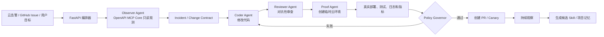

# Runtime-Aware Software Evolution Agent

## 基于 Qoder Cloud Agent、OpenAPI MCP Core 与 Skill 的 AI Native 方案

## 1. 背景

当前系统已经具备基础的软件开发 Agent 流程：

```text
用户创建任务
→ 选择 GitHub 仓库和基准分支
→ 创建 fix/feat 分支
→ Coder Agent 修改代码
→ Reviewer Agent 审查
→ 审查通过后创建 Pull Request
```

该流程具备一定工程完整度，但核心形态仍然是线性的“代码生成—代码审查—提交 PR”。Coder 和 Reviewer 都主要依据代码仓库及任务描述工作，无法感知应用在真实云环境中的运行状态，也难以证明候选修改在真实环境中确实解决了问题。

阿里云 OpenAPI MCP Server Core 可以让 Agent 通过自然语言匹配并调用阿里云 OpenAPI；Qoder Cloud Agent 支持通过 Vault 绑定 MCP OAuth，并加载 Cloud Use 或自定义 Skill。单纯接入 MCP 只能说明 Agent 获得了更多工具，并不足以构成核心创新。

本方案建议将产品重新定位为：

> 一个能够感知真实云环境、从运行证据中生成代码修复、在临时云环境中验证修改，并从成功任务中持续提炼技能的自主软件进化系统。

项目可命名为：

- CloudPatch
- LivingOps
- Runtime-Aware Coding Agent
- Autonomous Software Evolution System

## 2. 一句话定位

> 普通 Coding Agent 会修改代码；本系统能够从真实云故障中提取证据，将故障编译成回归测试，生成修复，在临时云环境中证明修复有效，并在受控权限下完成灰度、观察与回滚。

## 3. 5W1H 产品定义

| 维度 | 定位 |
|---|---|
| What | 云环境感知的自主软件修复与验证系统 |
| Why | Coding Agent 不理解真实运行状态，也无法证明修改在线上有效 |
| Who | DevOps、SRE、中小研发团队、开源项目维护者 |
| When | 云告警、CI 失败、GitHub Issue、发布验证和日常巡检时 |
| Where | GitHub、Qoder Cloud Agent、阿里云运行环境 |
| How | OpenAPI MCP、Skill、临时验证环境、证据门控、能力租约和持续学习 |

## 4. 总体架构



现有系统主要覆盖：

```text
Coder → Reviewer → PR
```

升级后的系统形成完整闭环：

```text
真实环境发现
→ 故障证据建模
→ 代码修改
→ 独立审查
→ 真实环境验证
→ 风险决策
→ PR / 灰度
→ 持续观察
→ 经验沉淀
```

## 5. 核心组件

### 5.1 FastAPI Orchestrator

负责：

- 接收 GitHub Issue、CI、云监控和外部 Webhook；
- 创建和管理 Qoder Cloud Agent Session；
- 管理任务状态机；
- 收集 Agent 事件、工具调用和测试结果；
- 调用 Policy Governor；
- 管理人工审批节点；
- 创建 PR，并将证据报告写入 PR 描述。

建议状态机：

```text
RECEIVED
→ OBSERVING
→ CONTRACT_READY
→ REPRODUCING
→ PATCHING
→ REVIEWING
→ PROVISIONING
→ VERIFYING
→ WAITING_APPROVAL
→ PR_CREATED
→ CANARY_OBSERVING
→ LEARNING
→ COMPLETED
```

### 5.2 Observer Agent

Observer Agent 使用只读 OpenAPI MCP Core：

- 查询运行资源；
- 获取日志、监控指标和部署版本；
- 识别受影响服务、地域和实例；
- 生成多个根因假设；
- 使用可证伪证据排除错误假设；
- 输出结构化 Incident Contract。

Observer 不允许执行重启、扩容、切流、删除等写操作。

### 5.3 Coder Agent

Coder Agent 负责：

- 根据 Incident Contract 或 Change Contract 修改代码；
- 创建 fix/feat 分支；
- 将真实故障转换为回归测试；
- 运行项目测试和静态检查；
- 提交代码；
- 输出修改文件、根因、测试结果和残余风险。

### 5.4 Reviewer Agent

Reviewer 应与 Coder 隔离上下文，只接收：

- 原始任务契约；
- 最终代码 Diff；
- 真实测试输出；
- 云端运行证据。

Reviewer 必须提交结构化发现，而不是简单返回 `approved=true`：

```json
{
  "verdict": "request_changes",
  "findings": [
    {
      "severity": "high",
      "claim": "并发刷新仍存在竞争窗口",
      "evidence": "src/auth/refresh.py:86",
      "verification_command": "pytest tests/auth/test_refresh_race.py",
      "confidence": 0.92
    }
  ],
  "residual_risks": []
}
```

### 5.5 Proof Agent

Proof Agent 使用受限的 Custom MCP：

- 创建临时验证环境；
- 部署 main 作为 baseline；
- 部署候选分支作为 candidate；
- 对两者执行相同测试或流量回放；
- 对比日志、响应、延迟和资源开销；
- 输出 Proof Report；
- 任务结束后销毁临时资源。

### 5.6 Policy Governor

Policy Governor 位于 Agent 之外，由确定性程序规则实现。

它负责：

- 判断哪些工具调用可以自动执行；
- 检查资源范围、环境、预算和有效期；
- 管理临时权限；
- 决定自动 PR、等待审批、拒绝或回滚；
- 保证模型的自然语言结论不能直接成为高权限控制信号。

## 6. AI Native 创新设计

## 6.1 Runtime-to-Test：将线上故障编译成回归测试

普通故障修复流程通常是：

```text
看到报错
→ 猜测根因
→ 修改代码
```

升级后的流程：

```text
读取日志、指标和资源配置
→ 提取最小故障证据
→ 生成 Incident Contract
→ 将线上故障转换成可重复测试
→ 确认测试在 main 上失败
→ Coder 修复
→ 确认测试在候选分支通过
```

示例 Incident Contract：

```json
{
  "signal": "POST /checkout 5xx_rate > 8%",
  "affected_version": "commit-a81c2",
  "observed_input_shape": {
    "coupon": null,
    "items": []
  },
  "expected_behavior": "返回 400，不得产生 500",
  "reproducer": "tests/regression/test_empty_checkout.py",
  "cloud_evidence": [
    "sls-log-id: xxx",
    "metric-window: 10:31-10:36"
  ]
}
```

核心价值：

> Agent 不是根据想象修复，而是把真实运行证据转换为可执行证明。

## 6.2 Capability Lease：面向 Agent 的临时能力租约

不要给 Agent 长期、宽泛的云资源权限。Agent 应先提交能力申请：

```json
{
  "required_capabilities": [
    {
      "action": "ecs:DescribeInstances",
      "reason": "确认故障实例所属部署版本",
      "mode": "read"
    },
    {
      "action": "ecs:RebootInstance",
      "reason": "执行临时止血",
      "mode": "write",
      "resource": "i-abc123",
      "ttl_minutes": 10
    }
  ]
}
```

FastAPI 后端根据策略决定：

| 操作 | 默认决策 |
|---|---|
| 查询日志、指标、资源状态 | allow |
| 创建预算内临时验证资源 | allow 或 ask |
| 重启、扩容、切流 | ask |
| 删除生产资源 | deny |
| 释放数据库 | deny |
| 修改根账号权限 | deny |

权限必须限制：

- 具体云账号；
- 具体地域；
- 具体资源；
- 具体 API Action；
- 时间有效期；
- 费用预算；
- 最大调用次数。

AI 负责推理“需要什么能力”，Policy Governor 负责真正授权。

## 6.3 双平面 MCP：发现广、执行窄

OpenAPI MCP Core 覆盖大量阿里云 API，通过语义搜索匹配 API。模糊意图可能匹配错误 API，而且 Core 版本不支持调优。Custom MCP 可以只选择需要的 API，并优化 API 及参数描述。

建议采用双平面架构：

| 平面 | MCP | 权限 | 作用 |
|---|---|---|---|
| Discovery Plane | OpenAPI MCP Core | 只读 | 查询资源、日志和指标，发现相关 API |
| Action Plane | Custom MCP | 精确白名单 | 创建临时环境、部署、扩容、切流 |
| Forbidden Plane | 不提供工具 | 永久拒绝 | 删除生产资源、释放数据库、修改根权限 |

执行流程：

```text
Core 发现资源和候选操作
→ Agent 提交 Action Proposal
→ 后端验证权限、预算和环境
→ 为任务授予窄化能力
→ 执行
→ 验证执行结果
→ 权限自动过期
```

## 6.4 Ephemeral Proof Environment：临时云证明环境

每次中高风险代码修改都可以创建临时验证环境：

```text
创建临时环境
→ 部署 main 作为 baseline
→ 部署候选分支作为 candidate
→ 执行相同测试和流量回放
→ 对比日志、响应、延迟和资源消耗
→ 生成 Proof Report
→ 销毁临时环境
```

Proof Report 示例：

```json
{
  "baseline": {
    "error_rate": 0.081,
    "p95_ms": 312
  },
  "candidate": {
    "error_rate": 0.0,
    "p95_ms": 284
  },
  "regression_tests": "36/36",
  "cloud_cost": "CNY 0.42",
  "environment_destroyed": true
}
```

核心叙事：

> 不是 Agent 认为自己修好了，而是在临时云环境中证明修好了。

## 6.5 Counterfactual Repair：反事实修复决策

发生故障时，Agent 不直接执行第一种方案，而是生成多个候选动作：

```text
方案 A：重启实例
方案 B：临时扩容
方案 C：回滚上一版本
方案 D：修复代码并重新发布
```

比较维度：

| 方案 | 恢复时间 | 风险 | 成本 | 可逆性 | 是否解决根因 |
|---|---:|---:|---:|---:|---:|
| 重启 | 2 分钟 | 中 | 低 | 高 | 否 |
| 扩容 | 5 分钟 | 低 | 高 | 高 | 否 |
| 回滚 | 4 分钟 | 中 | 低 | 高 | 可能 |
| 修复发布 | 25 分钟 | 中 | 中 | 中 | 是 |

系统可能选择组合策略：

```text
立即扩容止血
+ 并行创建代码修复 PR
+ 修复上线后恢复原容量
```

这种“短期止血 + 长期修复”的双时间尺度决策更符合真实 SRE 场景。

## 6.6 Skill Distillation：从成功轨迹提炼新 Skill

任务完成后分析完整成功轨迹：

```text
告警
→ 查询了哪些 API
→ 哪个证据区分了多个根因
→ 哪个修复最终有效
→ Reviewer 发现了什么
→ 发布后指标如何变化
```

然后生成候选 Skill：

```text
skills/
└── diagnose-fastapi-5xx/
    ├── SKILL.md
    ├── templates/
    │   └── incident-contract.json
    └── examples/
        └── successful-trace.json
```

Skill 可以沉淀：

- 触发条件；
- 必须查询的证据；
- API 调用顺序；
- 禁止动作；
- 中止条件；
- 验收指标；
- 常见误判；
- 回滚步骤。

Skill 发布流程：

```text
Agent 生成 Skill Candidate
→ 用历史 Incident 回放测试
→ Reviewer 审查
→ 人工批准
→ 上传 Skill 新版本
```

不允许 Agent 将未经审查的自生成 Skill 直接发布到生产 Agent。

该机制可以命名为：

> Experience-to-Skill Compiler：将成功经验编译成可复用能力。

## 7. Skill、MCP 与 Policy 的边界

三者必须明确分工：

| 组件 | 回答的问题 | 是否是安全边界 |
|---|---|---|
| Skill | 应该怎么做 | 否 |
| MCP | 能够做什么 | 部分 |
| Policy Governor | 是否允许做 | 是 |

Skill 不能替代权限控制。即使 Skill 写了“不要删除生产资源”，真正的删除 API 也应该在 MCP、RAM 和 Policy Governor 层被拒绝。

## 8. cloud-change-proof Skill 设计

推荐目录：

```text
cloud-change-proof/
├── SKILL.md
├── templates/
│   ├── incident-contract.json
│   ├── action-proposal.json
│   └── proof-report.md
├── policies/
│   └── cloud-action-matrix.yaml
└── examples/
    └── checkout-5xx.json
```

`SKILL.md` 核心步骤：

```text
1. 识别目标云账号、地域、环境和资源。
2. 默认只读，不得先执行变更。
3. 收集日志、指标、部署版本和配置差异。
4. 生成至少两个根因假设。
5. 为每个假设寻找可证伪证据。
6. 形成 Incident Contract。
7. 修改代码并生成回归测试。
8. 在临时环境验证候选修改。
9. 写操作必须提交 Action Proposal。
10. 发布后观察固定时间窗口。
11. 指标恶化立即执行预定义回滚。
12. 输出完整 Proof Report。
```

## 9. 风险治理

### 9.1 权限原则

- 不使用根账号 AK；
- 使用独立 RAM 用户或临时角色；
- 遵循最小权限；
- Core MCP 默认只读；
- 写操作使用窄化 Custom MCP；
- 删除、释放、根权限修改默认 deny；
- 凭据存储在 Qoder Vault 或密钥管理系统中；
- 不把 AK 写入 GitHub、Prompt、日志或 Session Metadata。

### 9.2 操作协议

所有云变更遵循：

```text
Plan
→ Simulate / Dry Run
→ Approve
→ Execute
→ Verify
→ Observe
→ Commit or Rollback
```

### 9.3 幂等与恢复

- 每个 Action Proposal 必须带幂等键；
- Webhook 按事件 ID 去重；
- 临时环境携带 Session ID 和过期时间标签；
- Agent 异常结束后由清理任务回收资源；
- 所有写操作记录调用前后状态；
- 回滚动作在执行变更前生成并验证。

## 10. MVP 建议

比赛版不需要实现全部能力。建议优先完成：

### P0：必须完成

1. Qoder Cloud Agent 绑定 OpenAPI MCP Core；
2. Observer Agent 只读查询云资源、日志和指标；
3. 将云端故障生成 Incident Contract；
4. 将故障生成成仓库回归测试；
5. Coder 修复代码；
6. Reviewer 独立审查；
7. 生成包含证据的 PR。

### P1：形成核心差异化

1. 创建临时验证环境；
2. 部署 main 和候选分支；
3. 对比 baseline 与 candidate；
4. 生成 Proof Report；
5. 写操作进入人工审批；
6. 自动销毁临时环境。

### P2：展示未来潜力

1. Capability Lease；
2. 多方案反事实决策；
3. Canary 自动观察；
4. Skill Candidate 自动生成；
5. 历史 Incident 回放评测。

## 11. 创新性与实现优先级

| 方向 | 创新性 | 实现难度 | 演示效果 |
|---|---:|---:|---:|
| Runtime-to-Test | 9/10 | 7/10 | 10/10 |
| 临时云证明环境 | 8/10 | 7/10 | 10/10 |
| Capability Lease | 9/10 | 8/10 | 8/10 |
| Skill Distillation | 9/10 | 8/10 | 8/10 |
| 多方案反事实决策 | 8/10 | 6/10 | 8/10 |
| 单纯接入 MCP | 3/10 | 3/10 | 5/10 |

比赛版推荐组合：

1. Runtime-to-Test；
2. Ephemeral Proof Environment；
3. Core 只读、Custom 写操作受控；
4. 任务结束后展示自动生成但尚未发布的 Skill Candidate。

## 12. 基于 SprintPilot Demo 仓库的演示剧本

### 故障设定

为 SprintPilot 增加一个可部署的故障版本：

```text
空项目调用 GET /projects/{project_id}/metrics 时产生 500。
```

### 演示流程

```text
1. FastAPI 编排器接收云监控告警 Webhook。
2. Observer Agent 通过 MCP 查询日志、部署版本和资源状态。
3. Agent 根据异常堆栈和请求信息定位除零错误。
4. Agent 生成 Incident Contract。
5. Agent 在仓库生成空项目 Metrics 回归测试。
6. 测试在 main 分支失败。
7. Coder 创建 fix/metrics-empty-project 分支并修复。
8. Reviewer 审查代码、回归测试和变更范围。
9. Proof Agent 创建临时云环境并部署候选分支。
10. 调用 Metrics API，确认响应由 500 变为 200。
11. 对比 main 与 candidate 的错误率和延迟。
12. Policy Governor 检查全部证据。
13. 系统创建包含 Proof Report 的 PR。
14. 系统从任务轨迹生成 diagnose-fastapi-zero-division Skill Candidate。
```

### PR Evidence Report 示例

```markdown
## Incident

Empty projects caused `GET /metrics` to return HTTP 500.

## Runtime evidence

- Affected deployment: commit-a81c2
- Observed exception: ZeroDivisionError
- Error rate: 8.1%

## Regression proof

- Test fails on main: yes
- Test passes on candidate: yes
- Full regression suite: 36/36

## Cloud proof

- Baseline: HTTP 500
- Candidate: HTTP 200
- Candidate p95: 84 ms
- Security findings: 0
- Temporary environment destroyed: yes

## Residual risk

No production database or API contract changes.

## Rollback

Revert the candidate commit and restore the previous deployment revision.
```

## 13. 答辩表述

评委问：“这和给 Qoder 接入阿里云 MCP 有什么区别？”

建议回答：

> MCP 只是 Agent 的工具接口，Qoder 是执行引擎。我们的创新位于执行引擎之上：系统从真实云环境中提取故障证据，将故障编译成回归测试，生成代码修复，在临时云环境中对 baseline 和 candidate 做对照实验，并通过独立的策略引擎决定是否允许创建 PR、灰度或回滚。任务完成后，成功轨迹还可以生成待审查的新 Skill，使系统在受控条件下持续进化。

评委问：“为什么这是 AI Native？”

建议回答：

> 如果移除 AI，系统就无法根据未知故障动态发现相关云 API、生成多个根因假设、把运行证据翻译成测试、提出候选修复方案，或把成功轨迹压缩成可复用 Skill。AI 不是界面上的聊天入口，而是整个发现、诊断、修复和学习闭环的核心控制变量。

## 14. 官方参考

- [Qoder Cloud Use](https://docs.qoder.com/zh/cloud-agents/best-practices/cloud-use)
- [Qoder Agent 工具配置](https://docs.qoder.com/zh/cloud-agents/tools)
- [Qoder Agent Skills](https://docs.qoder.com/zh/cloud-agents/skills)
- [Qoder 权限策略](https://docs.qoder.com/zh/cloud-agents/permission-policies)
- [阿里云 OpenAPI MCP Server 指南](https://www.alibabacloud.com/help/en/openapi/user-guide/openapi-mcp-server-guide)
